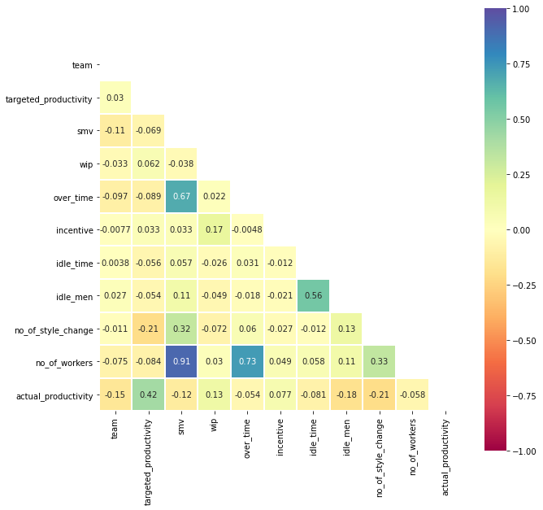
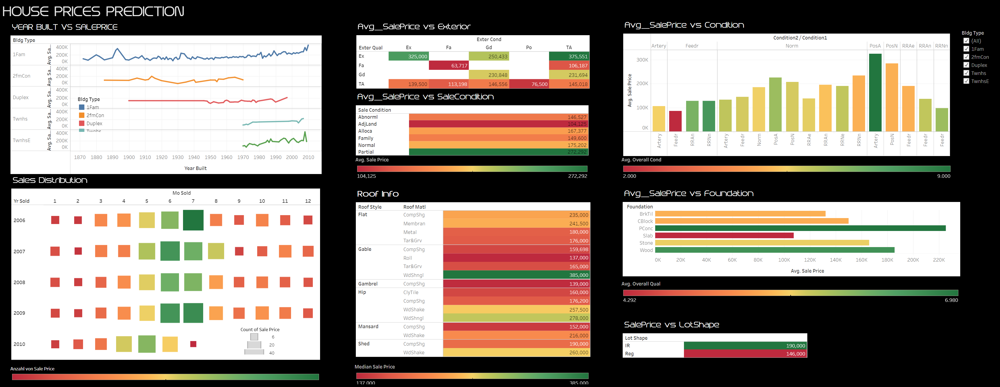
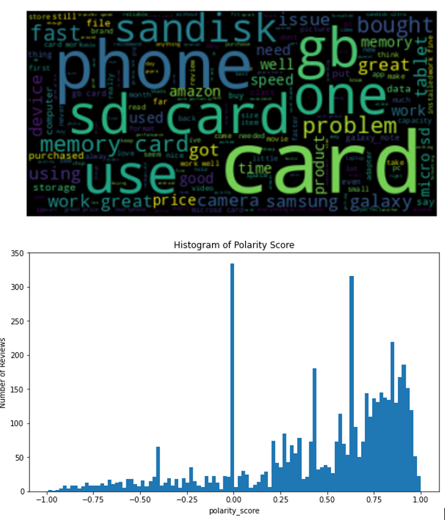
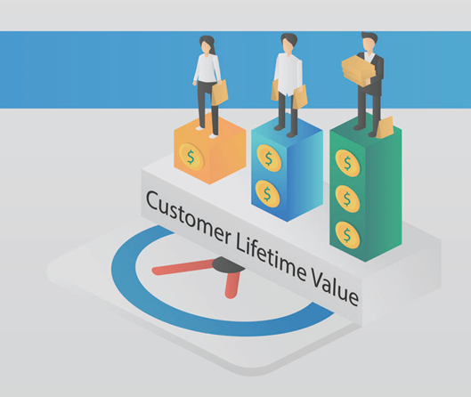
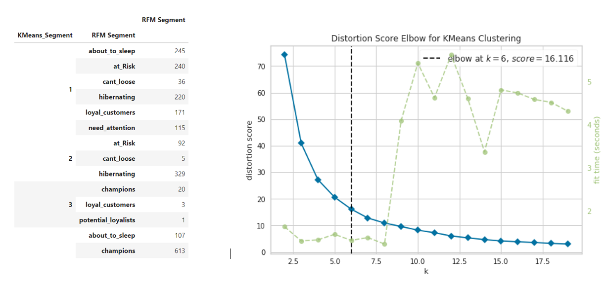
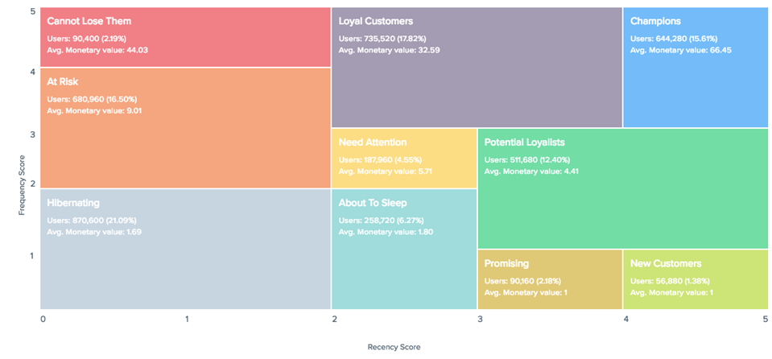
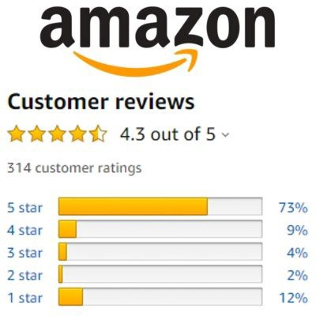
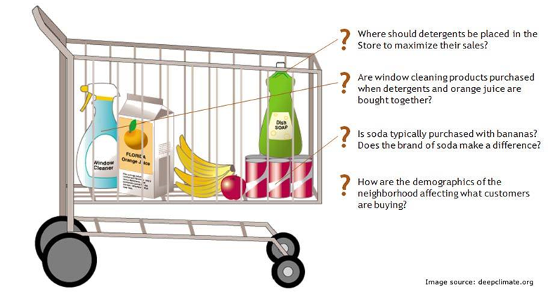

# Portfolio
---
## Classifications

### Telco Customer Churn Prediction

  
* Developed a predictive model to classify the potential churn customers based on numerical and categorical features using CatBoostClassifier 
  
* Compared the performance of base model and the model with feature engineering and achieved %2 better f1 score with the new model 
  
* Five of the newly created features are in the top 10 in feature importance ranking. 
  
* Analyzed data by creating a PowerBi dashboard 

---
### Urban Sounds Classification

  
* Implemented a CNN algorithm to classify urban sounds based on 8732 labeled sound excerpts from 10 classes  
  
* Converted sound excerpts to spectrograms using librosa library    
  
* Performed gray scale conversion, resizing and normalization on the spectrograms

---
### Garments_worker_productivity

 
* Analysed and predicted the productivity performance of the working teams in a factory by transforming the productivity range (0-1) into different classes.
  
* Examined the performance of the classification algorithms (Logistic Regression, Decision Tree Classifiers, Random Forests, Support Vector Machines, K-Nearest Neighbors, Gaussian Naive Bayes, LinearDiscriminantAnalysis) on the f1 metric and it was found that the best performance was the Random Forest Algorithm.

---
## Regression

### House Price Prediction

* Examined the performance of regression algorithms (GBM, Random Forest, XGBoost, Light GBM) by applying RMSE metrics to predict prices based on 81 features and found Light GBM to have the best performance 
  
* introducing +10 new attributes, resulting in increase in R2 score from 86% to 90% 
  
* Performed Exploratory Data Analysis and conducted feature engineering studies  
  
* Conducted automated hyperparameter tuning and applied stacking & ensemble learning 
  
* Visualized data using Tableau and Python libraries, created a dashboard

---
## Natural Language Processing

### Sentiment Analysis and Modeling for Amazon Reviews

* Conducted sentiment analysis in order to classify the negative and positive reviews of the customers for the products in the electronics category of Amazon. 
  
* Implemented a regression model (Random Forest) with the 90% f1 score to predict whether a new comment is negative or positive is by using word vectorization methods as count vectors, TF_IDF and TF-IDF N-Gram.

---
## Customer Relationship Management (CRM)

### CLTV Prediction with BG/NBD and Gamma&Gamma Models

* Processed, cleaned and formatted data using pandas
  
* Predicted the expected number of transactions for each customer using BG/NBD (Beta Geometric / Negative Binomial Distribution) Model and the expected average profit by using Gamma-Gamma submodel within 6-months 
  
* Predicted CLTV values to identify the customers who can generate the most revenue in 6-months.

---
### RFM vs. K-Means in Customer Segmentation

* Compared RFM and K-Means for a customer segmentation case based on online retail data. 10 and 6 clusters emerged with RFM technique and K-Means technique, respectively. As a result, the results obtained with the K-Means Technique were slightly more comprehensive than those obtained with the RFM.

 

 

---
### Customer Segmentation with RFM Analyse

 

* Applied RFM analysis in order to include customers with common behaviors in the same groups and segment them to develop special sales and marketing techniques for these groups

 

 

---
## Sorting & Rating & AB-Testing

### AB Test of Advertisement Bidding

* Performed AB Testing on Facebook's current and alternative bidding type to determine if there is a significant difference between the two options and which of the two options will increase clicks and purchases.

 

 

---
### Rating Products & Sorting Reviews with Wilson Lower Bound

* Calculated time-based weighted product ratings
  
* Determined the first 20 reviews that will be displayed on the product details using Wilson lower bound method.

 

 

---

## Recommendation-Systems

### Basket Analysis with Association Rule Learning

  
* Preparing the data in accordance with Association Rule Learning data structure requirements
  
* Extracted association rules using Apriori function and suggested a product to users at the basket stage.

 

 

---
### Matrix Factorization Based Movie Recommender

  
* Developed a recommendation system that gives estimated ratings for a given user and movie, based on the single value decomposition by using Surprise Library.

 

 

## Time Series

### Demand Forecasting with LightGBM

  
* Developed a 3-month demand forecasting model for the relevant retailer using the time series and machine learning techniques. The data set includes 5 years of data for 10 different stores and 50 different products.

 

 
---

